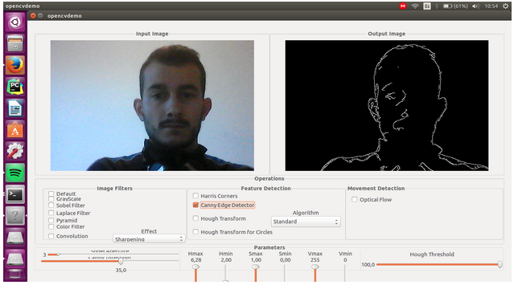

In this first week, I started installing the JdeRobot environment on my laptop following the steps provided in [http://jderobot.org/Installation#From_Debian_packages](http://jderobot.org/Installation#From_Debian_packages). After that, I tested that my installation was working fine by playing with some examples provided in the Documentation section. For example, the OpenCV demo ([http://jderobot.org/index.php/Examples#Cameraserver_.2B_Opencvdemo](http://jderobot.org/index.php/Examples#Cameraserver_.2B_Opencvdemo)). If you want to use this example, you have to open two terminals and type on each one the following lines respectively: 

<pre>
cameraserver cameraserver.cfg
</pre>

<pre>
opencvdemo opencvdemo.cfg
</pre>

Also, I have read some of the previous work from colleagues as the Final Grade Projects of Nuria Oyaga ("Análisis de Aprendizaje Profundo con la plataforma Caffe") and David Pascual ("Study of Convolutional Neural Networks using Keras Framework") and the Final Master Project of Marcos Pieras ("Visual people tracking with deep learning detection and feature tracking"). These works gave me an introduction to the Deep Learning basic concepts. Besides that, they show some of the State of the Art in detection, tracking and classification using Deep Learning techniques. 

