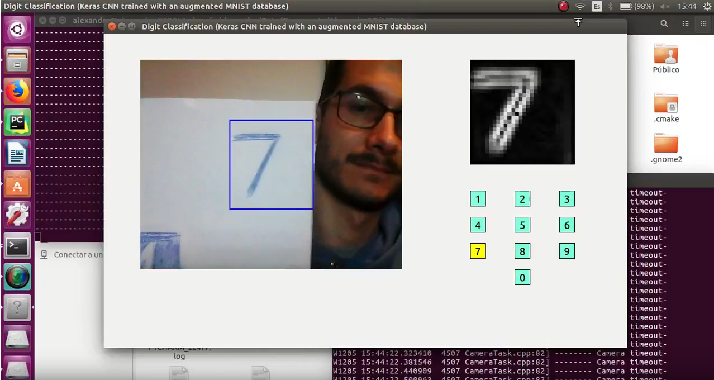
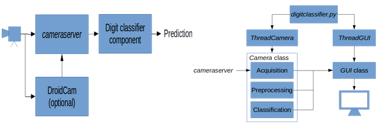

This week I ran David's code once I had the Keras model to feed the classifier as it can be seen in the following video: 

After that I studied the code and I saw the implementation done inside the digit classifier. This project follows the next design from a high level and a low level point of view (images are from David's project): 

Furthermore I finished the testing of Marcos' project and I launched it successfully. The next video shows the tracking performance over a set of frames from MOT16-04: 

This project uses a hybrid tracking approach with a neural network-based tracking and a feature-based tracking. The first one gives the system better detections but it is not able to work in real-time, so it returns detections every 30 frames. Meanwhile, the feature tracking component, which is able to work in real-time, computes the tracking between the frames. The process is shown in the next figure (image from Marcos' project): 

I also read an article with a recent object detection and segmentation technique called Mask R-CNN. The paper is available at [https://arxiv.org/pdf/1703.06870.pdf](https://arxiv.org/pdf/1703.06870.pdf) and also a Python implementation is available at [https://github.com/matterport/Mask_RCNN](https://arxiv.org/pdf/1703.06870.pdf). This framework efficiently detects objects in images and it generates high-quality segmentation masks in the instances. It can be easy generalized to achieve different tasks as person keypoint detections. This method extends Faster R-CNN and adds a branch for predicting an object mask in parallel with the branch for bounding box recognition. This way, it decouples mask and class prediction which allows better performance. They introduce a layer called RoIAlign to fix the pixel-to-pixel misalignment between network inputs and outputs of the Faster R-CNN and this way they preserve spatial locations. 

Mask R-CNN outperforms existing state-of-art techniques on COCO suite of challenges ([http://cocodataset.org/#home](http://cocodataset.org/#home)). And it gives better results in instance segmentation tasks on Cityscapes dataset ([https://www.cityscapes-dataset.com/](https://www.cityscapes-dataset.com/)) too. The next images show some of the commented results in object segmentation (left) and keypoints detection for human pose (right): 

