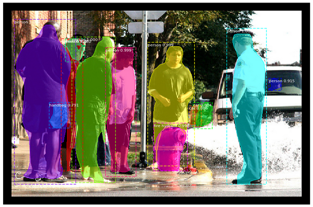

The actual task is to understand the Mask R-CNN code implementation available at [https://github.com/matterport/Mask_RCNN](https://github.com/matterport/Mask_RCNN) and test it on my personal laptop. To do so, I started by running a demo example of using a pre-trained model on MS COCO to segment objects in your own images ([https://github.com/matterport/Mask_RCNN/blob/master/demo.ipynb](https://github.com/matterport/Mask_RCNN/blob/master/demo.ipynb)). The first step to run the demo is to clone the Mask R-CNN repository mentioned before. Furthermore, this demo has the following main requisites of installation: pycocotools and Keras with Tensorflow backend. To install pycocotools (with Python 3) you need to type on terminal this instructions: 

<pre>
git clone https://github.com/pdollar/coco.git
cd coco/PythonAPI
make
sudo make install
sudo python3 setup.py install
</pre>

and then append your COCO' local folder to the system path (example): 

<pre>
sys.path.append('/home/alexandre/coco/PythonAPI')
</pre>

The next image shows one of the results that can be achieved when you run this demo on test images (from the folder 'images' of the Mask R-CNN repository): 

