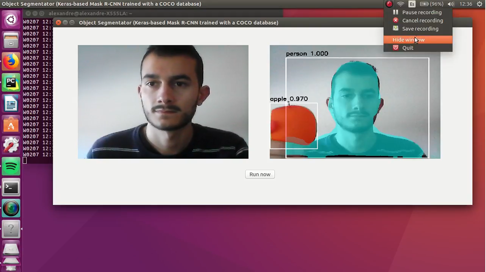

With the objective of building a visual memory for a robot the first required step is to develop an object-segmentator component running in real-time with a video stream. It will be build with a structure of 3 branches: Camera, GUI and Net. The first approach will be an application working using the camera server component video with two toggle buttons that allow the user to choose between passing to the net a single frame or a continuous sequence of frames from the camera. For this purpose, I re-use parts of code already done from [https://github.com/JdeRobot/dl-objectdetector](https://github.com/JdeRobot/dl-objectdetector), thanks to Nacho.

This week I put the Mask R-CNN model working in real time with a single frame from the camera. By now the net has recognized objects like 'person', 'cell-phone', 'bed', 'apple' and more without problems. The following video shows the application working (this is an early implementation, the Net is runned over a laptop without GPU and with a poor camera so the results could be improved). 

