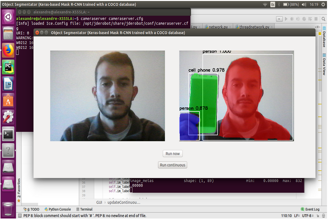

This week I added the 'Run continuous' mode to the application which allows the user to segment the video stream from the webcam in 'real-time'. This real-time is obviously conditioned by the time that needs the computer to process the image using the Mask R-CNN, which in my case takes about 25 seconds (using CPU). The following image shows one of the results achieved with this new implemented mode: 

