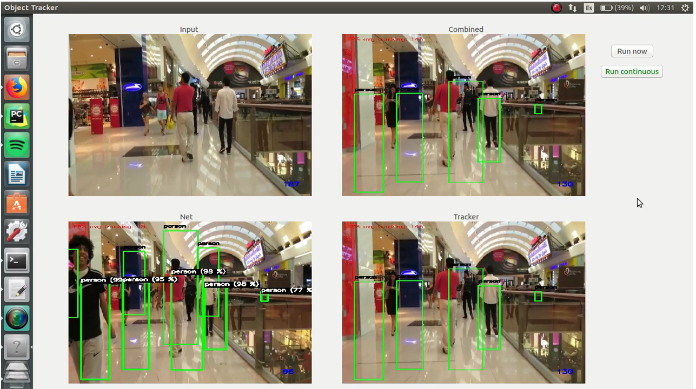

This last two weeks were mainly used to introduce a way to start to obtain statistics from the application. The results obtained from both the Net (neural network detections) and the Tracker are now logged into .yaml files. The format of the file has the following structure: 

<pre>
 - 60   <-- frame number
 - person  <-- class
 - 0.9  <-- confidence
 - - 130  <-- left
   - 148  <-- top
 - - 170  <-- right
   - 340  <-- bottom
</pre>

This log of the results is done online at the end of the application execution. To get statistics the idea is to use the Pascal VOC performance measurements: precision, recall, precision x recall curve and AP (average precision). This repo provides the metrics already calculated [https://github.com/rafaelpadilla/Object-Detection-Metrics](https://github.com/rafaelpadilla/Object-Detection-Metrics) and you only need to adapt the format of your results and the ground truth to the format used.

Format used in the detection files (your results): 

<pre>
bottle 0.14981 80 1 295 500
bus 0.12601 36 13 404 316
horse 0.12526 430 117 500 307
pottedplant 0.14585 212 78 292 118
tvmonitor 0.070565 388 89 500 196 
</pre>

Format used in the ground truth files: 

<pre>
bottle 6 234 39 128
person 1 156 102 180
person 36 111 162 305
person 91 42 247 458 
</pre>

The results obtained in the .yaml files are easily converted to the required format using a bash file (+python script) made explicitly for the offline format conversion [https://github.com/RoboticsURJC-students/2017-tfm-alexandre-rodriguez/tree/develop/dl_objecttracker/detections](https://github.com/RoboticsURJC-students/2017-tfm-alexandre-rodriguez/tree/develop/dl_objecttracker/detections). The repo also provides other formats to use but I found that the more readable and easy to implement on my application. In terms of datasets, some reserch was done to find out which are the state of the art datasets in multiobject tracking. Some of the most significant are MOT ([https://motchallenge.net/](https://motchallenge.net/)), VOT ([http://votchallenge.net/](http://votchallenge.net/)), OTB, PETS ([http://www.cvg.reading.ac.uk/PETS2009/](http://www.cvg.reading.ac.uk/PETS2009/)) or NFS ([http://ci2cv.net/nfs/index.html](http://ci2cv.net/nfs/index.html)). With [https://github.com/jvlmdr/trackdat](https://github.com/jvlmdr/trackdat) you can download easily most of the previous datasets and many more. The next step is to convert the format of the ground truth in the datasets used to the one used in [https://github.com/rafaelpadilla/Object-Detection-Metrics#create-the-ground-truth-files](https://github.com/rafaelpadilla/Object-Detection-Metrics#create-the-ground-truth-files) to obtain the statistics. 

Also, the objecttracker.yml was modified (and the code too) to allow the user to choose between OpenCV or dlib tracking. And, if using OpenCVs tracking the option to select which tracker to use from KCF, BOOSTING, MIL, TLD, MEDIANFLOW, CSRT and MOSSE (default options are OpenCV tracking and MOSSE).

The next video provides an idea of the current state of the dl-objecttracker: 

<pre>
-Neural network detections: mask_rcnn_inception_v2_coco_2018_01_28
</pre>

<pre>
-Tracking: MOSSE OpenCV tracker
</pre>

With respect to the different sources the application includes local video (as before) and live video from OpenCV local camera. I am working on introducing video using ROS. 

